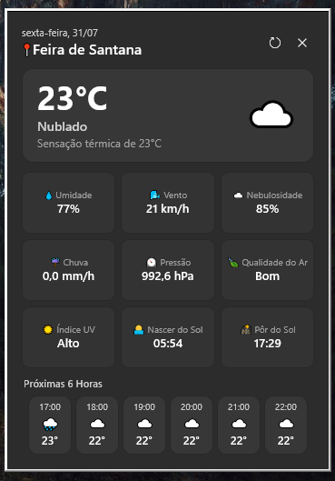

# ☀️ SkyTray Weather

<p align="center">
  <a href="#-skytray-weather---português">🇧🇷 Português</a> •
  <a href="#-skytray-weather---english">🇺🇸 English</a>
</p>

<p align="center">
  
  
  
  
</p>

<p align="center">
  
</p>

---

## 🇧🇷 SkyTray Weather - Português

**SkyTray Weather** é um aplicativo desktop nativo para Windows 11/10 projetado para rodar de forma discreta, elegante e ultra-rápida na bandeja do sistema (System Tray).

Com uma interface moderna inspirada nas diretrizes do Windows 11 (Acrylic/Mica), o SkyTray exibe um painel completo com 11 métricas meteorológicas em tempo real, previsão para as próximas 6 horas, suporte a internacionalização (Português e Inglês) e ícones vetoriais de alta definição na barra de tarefas.

---

### 🌟 Funcionalidades

- ☀️ **Ícone Vetorial Dinâmico no Tray**: Renderização vetorial GDI+ nativa em alta definição (32bpp ARGB) que altera o ícone de acordo com o tempo (Sol, Lua, Parcialmente Nublado, Chuva, Tempestade, Neve).
- 📍 **Localização Automática**: Geolocalização nativa do Windows com fallback automático via IP para nunca deixar você sem previsão.
- 📊 **Painel com 11 Métricas de Clima**:
  - 🌡️ Temperatura e Sensação Térmica
  - ☁️ Nebulosidade (%)
  - 💧 Umidade (%)
  - ⏲️ Pressão Atmosférica (hPa)
  - 🌬️ Velocidade do Vento (km/h)
  - ☔ Precipitação / Chuva (mm/h)
  - 🍃 Qualidade do Ar (AQI)
  - ☀️ Índice UV Max
  - 🌅 Horário do Nascer do Sol
  - 🌇 Horário do Pôr do Sol
  - 🕒 Previsão Hora a Hora para as Próximas 6 Horas
- 🌐 **Internacionalização (i18n)**: Detecção automática do idioma do sistema operacional com dicionários JSON (`pt_BR.json` e `en_US.json`).
- ⚙️ **Configurações e Inicialização**:
  - Opção para **Iniciar com o Windows** (Registro `HKCU\...\Run`).
  - Intervalo de Atualização Personalizável (5 min, 10 min, 15 min [padrão], 30 min, 60 min).
- ❌ **Execução em Segundo Plano**: Fechar a janela minimiza o app diretamente para a bandeja do sistema. Clique com o botão direito no ícone para acessar as Configurações ou Sair.

---

### 🚀 Instalação Rápida (1-Clique)

1. Vá até a seção **[Releases](https://github.com/tomas-barros1/SkyTray-Weather/releases)** e baixe o `SkyTray-Weather-win-x64.zip`.
2. Extraia o conteúdo e execute o script `Install-SkyTray.ps1` no PowerShell:

```powershell
powershell -File Install-SkyTray.ps1
```

O aplicativo será instalado automaticamente em `%LocalAppData%\SkyTrayWeather` com atalho criado no seu **Menu Iniciar**.

---

### 🌐 Fontes de Dados

| Serviço | Uso | Licença |
|---|---|---|
| **[Open-Meteo](https://open-meteo.com/)** | Previsão do tempo (temperatura, vento, precipitação, UV, etc.) e qualidade do ar | Grátis, sem API key |
| **[BigDataCloud](https://www.bigdatacloud.com/)** | Geocodificação reversa (coordenadas → nome da cidade) | Grátis |
| **[ipapi.co](https://ipapi.co/)** | Fallback de geolocalização via IP quando a localização nativa não está disponível | Grátis |

> O dado de **"☔ Chuva"** exibido no painel é a **probabilidade de precipitação** (`precipitation_probability`) da hora atual, fornecida pela Open-Meteo — não a leitura instantânea em mm.

---


```text
├── WinuiWheaterForecastTray.Core/      # Biblioteca de domínio .NET 8 (DTOs, Serviços, i18n, APIs)
├── WinuiWheaterForecastTray/           # Aplicação UI WinUI 3 (Windows App SDK, Renderizador Tray, XAML)
├── WinuiWheaterForecastTray.Tests/     # Suíte de Testes Automatizados xUnit (16 testes unitários e de integração)
├── Install-SkyTray.ps1                 # Script de instalação de 1-clique para Windows
└── .github/workflows/                  # Automação CI/CD GitHub Actions
```

---

<br/>

---

## 🇺🇸 SkyTray Weather - English

**SkyTray Weather** is a native Windows 11/10 desktop application designed to run quietly, elegantly, and lightning-fast directly from your System Tray.

Featuring a modern Windows 11 Fluent interface (Acrylic/Mica backdrop), SkyTray delivers a full dashboard with 11 real-time weather metrics, next 6-hour forecast, internationalization (Portuguese & English), and crisp vector tray icons.

---

### 🌟 Features

- ☀️ **Dynamic Vector Tray Icons**: Native GDI+ 32bpp ARGB anti-aliased vector rendering that dynamically switches tray icons according to weather condition (Sun, Moon, Partly Cloudy, Rain, Thunderstorm, Snow).
- 📍 **Automatic Location Detection**: Windows native Geolocator with automatic IP geolocation fallback.
- 📊 **11 Weather Metrics Dashboard**:
  - 🌡️ Temperature & Feels Like Temperature
  - ☁️ Cloud Cover (%)
  - 💧 Humidity (%)
  - ⏲️ Surface Pressure (hPa)
  - 🌬️ Wind Speed (km/h)
  - ☔ Rain / Precipitation (mm/h)
  - 🍃 Air Quality Index (US AQI)
  - ☀️ Max UV Index
  - 🌅 Sunrise Time
  - 🌇 Sunset Time
  - 🕒 Next 6 Hours Forecast
- 🌐 **Internationalization (i18n)**: Auto-detects OS UI language with JSON translation dictionaries (`pt_BR.json` and `en_US.json`).
- ⚙️ **Settings & Autostart**:
  - **Start with Windows** autostart toggle (`HKCU\...\Run`).
  - Configurable Refresh Interval (5 min, 10 min, 15 min [default], 30 min, 60 min).
- ❌ **Background Persistence**: Closing the window hides it directly to the system tray. Right-click the tray icon to open Settings or Exit.

---

### 🚀 Quick 1-Click Installation

1. Go to the **[Releases](https://github.com/tomas-barros1/SkyTray-Weather/releases)** page and download `SkyTray-Weather-win-x64.zip`.
2. Extract the ZIP archive and run `Install-SkyTray.ps1` in PowerShell:

```powershell
powershell -File Install-SkyTray.ps1
```

The application will automatically install to `%LocalAppData%\SkyTrayWeather` and create a Start Menu shortcut.

---

### 🌐 Data Sources

| Service | Purpose | License |
|---|---|---|
| **[Open-Meteo](https://open-meteo.com/)** | Weather forecast (temperature, wind, precipitation probability, UV index, etc.) and air quality | Free, no API key required |
| **[BigDataCloud](https://www.bigdatacloud.com/)** | Reverse geocoding (coordinates → city name) | Free |
| **[ipapi.co](https://ipapi.co/)** | IP-based geolocation fallback when native Windows location is unavailable | Free |

> The **"☔ Rain"** panel value shows the **precipitation probability** (`precipitation_probability`) for the current hour from Open-Meteo — not the instantaneous mm accumulation.

---

### 🧪 Running Tests

```powershell
dotnet test WinuiWheaterForecastTray.Tests/WinuiWheaterForecastTray.Tests.csproj --logger "console;verbosity=normal"
```

---

## 📄 License

Distributed under the MIT License. See `LICENSE` for more information.
